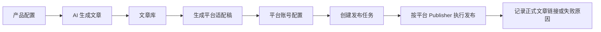

# ContentPilot AI

> 一个从“产品信息”到“多平台营销稿”的 AI 内容生产与发布管理平台。

ContentPilot AI 是一个面向内容运营、增长团队和产品营销人员的内部工具。它的目标不是简单生成一篇文章，而是把一篇营销内容从 **产品资料整理、AI 初稿生成、多平台改写、发布任务创建、发布执行、发布结果记录** 串成一条完整工作流。

如果你正在推广一个产品，通常会遇到这些问题：

- 🧠 每次写文章都要重复整理产品介绍、优势、目标用户和品牌语气。
- ✍️ 同一篇内容不能直接复制到微信公众号、知乎、CSDN、掘金等平台。
- 🧩 不同平台的标题、结构、语气、技术细节和营销浓度都不一样。
- 📌 内容生成后，还需要管理文章状态、平台稿版本、发布任务和结果链接。
- 🔐 自动发布涉及平台登录态、Cookie、验证码和风控，必须清晰记录失败原因并尊重平台安全边界。

ContentPilot AI 解决的就是这条链路：让运营人员先维护一份产品上下文，再围绕推广主题生成文章，并自动改写成不同平台适合阅读和发布的版本。

## 适合谁使用

| 用户 | 典型诉求 |
|---|---|
| 内容运营 | 快速生成产品介绍、教程、解决方案、SEO 文章 |
| 增长团队 | 批量准备不同渠道的推广内容 |
| 产品营销 | 保持品牌语气、卖点和禁用词一致 |
| 技术内容团队 | 把同一主题改写成 CSDN、掘金等技术社区风格 |
| 内部工具开发者 | 参考 AI 内容生成、平台适配、发布任务的完整 MVP 架构 |

## 它能做什么

### 1. 维护产品上下文

在「产品配置」里填写当前要推广的产品信息：

- 产品名称
- 产品简介
- 官网链接
- 核心功能
- 目标用户
- 产品优势
- 品牌语气
- 禁用词/敏感词

这些信息会作为 AI 生成和平台改写的基础上下文，避免每次生成内容都从零开始描述产品。

### 2. 生成营销文章

运营人员输入一个推广主题，选择文章类型和语言，系统会生成：

- 标题
- 摘要
- Markdown 正文
- 标签
- 推荐关键词

支持的文章类型包括：

- 产品介绍
- 使用教程
- 行业科普
- 竞品对比
- 解决方案
- SEO 文章

### 3. 适配多个内容平台

同一个主题，在不同平台上的写法应该不同。ContentPilot AI 会根据平台特点改写内容：

| 平台 | 内容风格 |
|---|---|
| 微信公众号 | 更重场景、痛点、传播感和轻营销引导 |
| 知乎 | 更重问题背景、逻辑推导、客观观点 |
| CSDN | 更重技术步骤、配置说明、实践价值 |
| 掘金 | 更重开发者经验、效率工具、轻量技术分享 |

### 4. 管理文章和平台稿

系统会保存原始文章和不同平台的发布稿。运营人员可以查看、编辑、归档文章，也可以单独维护某个平台的标题、正文、标签和关键词。

### 5. 创建和执行发布任务

内容准备好后，可以创建发布任务：

- 选择文章
- 选择平台稿
- 选择平台账号
- 设置立即发布或定时发布
- 提交为待发布状态
- 提交任务后按平台发布器执行真实发布或浏览器自动化

当前 MVP 已打通多平台真实发布试点：

| 平台 | 当前发布能力 |
|---|---|
| 微信公众号 | 官方 API 创建草稿；配置允许时提交正式发布并刷新状态 |
| 掘金 | 非官方接口试点：新建草稿、更新内容、提交发布、同步文章状态 |
| CSDN | Playwright 浏览器自动化：复用登录态、填充编辑器、处理发布弹窗、检测结果 |
| 知乎 | Playwright 浏览器自动化：填标题正文、检测发布设置、处理话题、自动点击发布、创作中心确认 |

所有浏览器自动化都遵守安全边界：不绕过登录、不绕过验证码、不规避平台风控。

## 一个简单例子

假设你要推广一个叫 **CodeReview Pro** 的代码审查工具。

### 第一步：配置产品信息

在「产品配置」中填写：

```text
产品名称：CodeReview Pro
产品简介：一个帮助研发团队自动发现代码风险、生成审查建议的 AI 工具
目标用户：研发团队、技术负责人、代码审查负责人
核心功能：AI 代码审查、风险提示、审查报告、团队协作
产品优势：减少人工 review 压力，提高代码质量，沉淀团队规范
品牌语气：专业、清晰、技术向、不过度营销
禁用词：绝对安全、100% 准确、替代程序员
```

### 第二步：生成一篇文章

在「AI 生成」里输入主题：

```text
研发团队为什么需要 AI 代码审查工具？
```

选择：

```text
文章类型：解决方案
语言：中文
```

系统会生成一篇完整文章，例如包含：

- 研发团队 review 压力越来越大的背景
- 人工审查容易遗漏的问题
- AI 代码审查适合承担的辅助角色
- CodeReview Pro 的使用场景
- 面向技术团队的温和转化引导

### 第三步：生成平台稿

进入文章详情，选择生成平台适配稿：

```text
微信公众号：偏场景化和传播感
知乎：偏问题分析和理性建议
CSDN：偏工具实践和使用步骤
掘金：偏开发者效率和经验分享
```

系统不会简单复制原文，而是按平台阅读习惯重组内容。

### 第四步：创建发布任务

进入「发布任务」：

```text
文章：研发团队为什么需要 AI 代码审查工具？
平台稿：掘金版本
平台账号：公司掘金账号
发布方式：立即发布
```

提交后，任务进入 `PENDING` 状态。运营人员触发自动发布后，系统会根据平台账号的默认发布方式选择 Publisher：掘金走非官方接口试点，微信公众号走官方 API，CSDN 和知乎走 Chrome for Testing 浏览器自动化。成功后记录正式文章链接；如果只能确认平台发布成功但没有拿到正式链接，则记录平台管理页并给出人工查看提示。

## 工作流



## 当前完成度

✅ 已完成：

- 产品配置
- AI 文章生成
- 文章库
- Markdown 编辑与预览
- 微信公众号、知乎、CSDN、掘金平台稿生成
- 平台账号配置
- 发布任务创建、提交、取消、执行
- 发布任务执行链路验证
- 微信公众号官方 API 草稿创建、可选正式发布、状态刷新
- 掘金新建草稿、更新内容并提交真实文章发布
- CSDN 浏览器自动化填充和自动发布试点
- 知乎浏览器自动化填充、发布设置处理和自动发布试点
- `NEED_LOGIN`、`NEED_CAPTCHA`、`NEED_MANUAL_CONFIRM`、`CONTENT_REJECTED`、`LINK_FETCH_FAILED` 等平台状态展示

🚧 暂不包含：

- SaaS 多租户和计费
- 复杂权限系统
- 真实数据看板和追踪链接
- 定时调度和失败重试
- 平台验证码、登录验证或风控绕过
- 知乎 HTTP 非官方接口
- CSDN / 知乎失败自动重试
- 绕过验证码、登录验证或平台风控的能力

## 技术栈

### 后端

- Java 17
- Spring Boot 3.3.5
- Spring Security + JWT
- MyBatis-Plus
- MySQL
- Maven

### 前端

- React 18
- TypeScript
- Vite
- Ant Design
- MobX
- Axios
- React Router

## 项目结构

```text
.
├── backend/                 # Spring Boot 后端
│   ├── src/main/java/       # 业务代码
│   └── src/main/resources/  # 配置、schema.sql、data.sql
├── frontend/                # React 前端
│   └── src/
├── docs/                    # 产品设计、平台策略和阶段说明文档
└── README.md
```

## 本地运行

### 1. 准备数据库

本地创建 MySQL 数据库：

```sql
CREATE DATABASE ai_content_marketing DEFAULT CHARACTER SET utf8mb4 COLLATE utf8mb4_unicode_ci;
```

后端启动时会根据 `schema.sql` 和 `data.sql` 初始化基础表和默认管理员用户。

### 2. 配置后端

默认配置在：

```text
backend/src/main/resources/application.yml
```

建议把本地敏感配置放到下面这个文件中：

```text
backend/config/application-local.yml
```

该文件已被 `.gitignore` 忽略，不会提交到 Git。

示例：

```yaml
spring:
  datasource:
    url: jdbc:mysql://localhost:3306/ai_content_marketing?useUnicode=true&characterEncoding=utf-8&serverTimezone=Asia/Shanghai
    username: root
    password: your_mysql_password
```

DeepSeek 相关配置当前通过环境变量读取：

```bash
export DEEPSEEK_API_KEY=your_deepseek_api_key
export DEEPSEEK_BASE_URL=https://api.deepseek.com
export DEEPSEEK_MODEL=deepseek-v4-pro
export DEEPSEEK_TIMEOUT_SECONDS=60
```

请不要提交真实数据库密码、DeepSeek Key、Cookie、csrfToken 或其他平台认证信息。

### 3. 启动后端

```bash
cd backend
mvn spring-boot:run
```

默认后端地址：

```text
http://localhost:8080
```

### 4. 启动前端

```bash
cd frontend
npm install
npm run dev
```

默认前端地址：

```text
http://localhost:5173
```

前端开发代理会把 `/api` 请求转发到 `http://localhost:8080`。

## 发布安全边界

发布平台的自动化能力必须尊重平台规则。ContentPilot AI 的设计原则是：

- 不绕过验证码。
- 不绕过登录验证。
- 不规避平台风控。
- 不做刷量、自动评论或模拟真人行为。
- 遇到登录失效、验证码、风控或审核失败时，系统记录可读失败原因，不绕过平台限制。

掘金平台目前支持新建草稿、更新内容并提交发布。微信公众号支持官方 API 草稿和发布状态链路。CSDN、知乎通过 Chrome for Testing 复用本地登录态完成浏览器自动化。涉及 Cookie、csrfToken、categoryId、tagIds、browserUserDataDir 等本地配置时，请只保存在平台账号的本地认证配置中，不要提交到仓库。

## 相关文档

- `docs/AI_Content_Marketing_System_Product_Design_MVP.md`
- `docs/project-progress-summary.md`
- `docs/ai-generation.md`
- `docs/platform-content-adaptation.md`
- `docs/platform-publishing-strategy-reference.md`

## License

当前未指定开源许可证。正式公开使用前请先补充 License。
